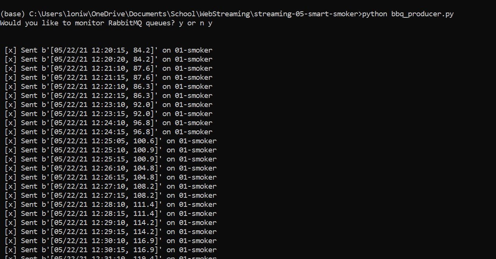
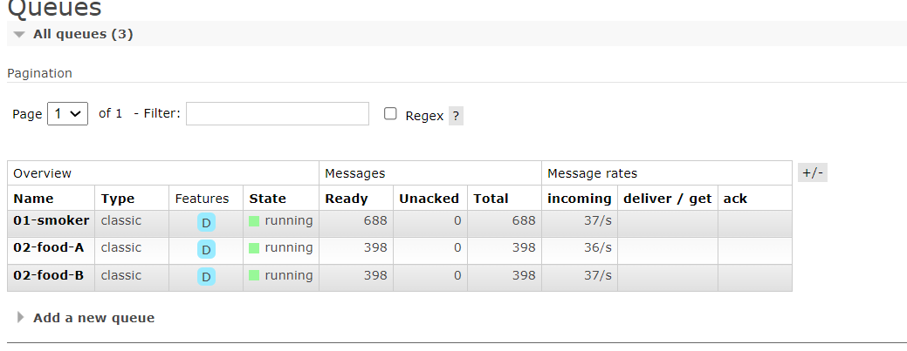

Loni Wood  

February 8, 2023
## Creating a Producer

# Overview:
The purpose of this code is to take a csv file and create a producer with three queues.  Each column of the csv will be sent to individual queues.

# Before you begin
Before you being running, be sure you have the following installed and running.
- pika
- RabbitMQ:
    You can find additional information on how to set up RabbitMQ at: https://www.rabbitmq.com/download.html
- active conda environment
- open anaconda prompt terminal

# How to run this program:
## Files you will be using:
 - bbq_producer.py
     - You will need to review the following and make updates if needed:
        - Check your host.  If it is not the "localhost", update
        - Determine if you would like to have the RabbitMQ website prompt you to open. If you do, ensure that show_offer is set to True, otherwise set it to False.
 
 - smoker-temps.csv
     - There are 4 columns in this csv file
        - Time = Date-time stamp for the sensor reading
        - Channel1 = Smoker Temp
        - Channel2 = Food A Temp 
        - Channe3 = Food B Temp 

# Assignment - Smart Smoker 

## Using a Barbeque Smoker
When running a barbeque smoker, we monitor the temperatures of the smoker and the food to ensure everything turns out tasty. Over long cooks, the following events can happen:

## The smoker temperature can suddenly decline.
The food temperature doesn't change. At some point, the food will hit a temperature where moisture evaporates. It will stay close to this temperature for an extended period of time while the moisture evaporates (much like humans sweat to regulate temperature). We say the temperature has stalled.
 

## Sensors
We have temperature sensors track temperatures and record them to generate a history of both (a) the smoker and (b) the food over time. These readings are an example of time-series data, and are considered streaming data or data in motion.

 
## Streaming Data
Our thermometer records three temperatures every thirty seconds (two readings every minute). The three temperatures are:

 - the temperature of the smoker itself.
 - the temperature of the first of two foods, Food A.
 - the temperature for the second of two foods, Food B.
 

## Significant Events
We want know if:

The smoker temperature decreases by more than 15 degrees F in 2.5 minutes (smoker alert!)
Any food temperature changes less than 1 degree F in 10 minutes (food stall!)
 
## Smart System
We will use Python to:

Simulate a streaming series of temperature readings from our smart smoker and two foods.
Create a producer to send these temperature readings to RabbitMQ.
Create three consumer processes, each one monitoring one of the temperature streams. 
Perform calculations to determine if a significant event has occurred.
 

## Optional: Alert Notifications
Optionally, we can have our consumers send us an email or a text when a significant event occurs. 
You'll need some way to send outgoing emails. I use my main Gmail account - other options are possible. 

# Screenshots of Program Running:
## Screenshot in Anaconda Prompt

## Screenshot in RabbitMQ
